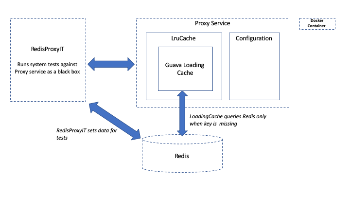

# Redis Proxy
Redis Proxy is a service which consists of an LRU cache (with TTL) on top of a single Redis backing instance.

## Architecture



### Main classes
* **RedisProxy** - Simple Spark java service which returns the value from the co.saikat.LruCache. When the
specified key is missing from the LruCache the service goes to backing Redis instance to retrieve the value. If the 
backing redis instance is missing the key as well, the service returns a HTTP 404.
* **Configuration** - Class which defines the configuration of the proxy webservice through an environmental Map<String,String> 
* **LruCache** - A LRU local cache configured through Guava's CacheBuilder which has TTL & a fixed capacity. When the 
LocalCache instance is missing a key, the cache makes a call to Redis (through the Jedis client) to determine the value.   
* **RedisProxyIT** - jUnit Integration Test class which treats the Redis proxy service as a black box. Configured 
through environmental variables and reliant on a specific configuration of the proxy service (see Javadoc)

## How the code works
The RedisProxy, Redis instance, and IntegrationTest are all containerized services. 

The RedisProxy service has a GET endpoint at GET /cache/:key which returns the key value in the body.
It also has a DELETE /cache meant to be used for easy integration testing.

A GET request results in a method call to LruCache#get which is a LoadingCache in Guava. 
If the cache contains the key it will return or otherwise it will call the loading method. The loading method fetches
the value from the Redis instance through the Jedis client. Thus, the LruCache, is a wrapper to Guava cache which
supports all the required specs.

The integration test class (RedisProxyIT) is a containerized service which interacts with the proxy service and redis.
It defines the data required for the test through Redis, makes an HTTP request through Apache's HTTP client, and then verifies
the HTTP response is the expected one. 


## Configuration
Follow the 12 factor approach, the application determines its configuration on startup through 
environmental variables:
* `PROXY_PORT`: The port of the proxy service (default: `4567`)
* `CACHE_CAPACITY`: Maximum number of keys the cache can have. (default: `10`)
* `REDIS_ADDRESS`: The Redis server address. Must have port & host (default: `localhost:6379`)
* `CACHE_EXPIRY_SECONDS`: Maximum number of seconds before a key,value expires. When a key value expires any future 
fetches of the key go to the backing Redis instance. Note that Guava caches don't immediately evict expired values for
performance reasons (see https://github.com/google/guava/wiki/CachesExplained#eviction)

## Algorithmic Complexity

As noted from the [Google docs](https://github.com/google/guava/blob/master/guava/src/com/google/common/cache/CacheBuilder.java):
> The returned cache is implemented as a hash table with similar performance characteristics to 
> {@link ConcurrentHashMap}.

ConcurrentHashMap has a O(1) performance complexity for `put` & `get` operations and Guava's loading Cache is the same. A
home grown solution involving a Map & DoublyLinkedList would also have constant time performance since:
* `get` - Would be a look on the Map [O(1)]
* `put` - Would involve moving the node to the head of the list if the key exists [O(1)], 
   setting an entry in th map [0(1)], and possibly removing the tail if the list is over capacity [O(1)]


The memory footprint is proportional to the product of the capacity & concurrency level (this is different from a normal
Hashmap). The overall complexity is O(n) where n is the number of elements stored. The memory footprint is larger for 
a Guava cache compared to ConcurrentHashmap (but the same O complexity).

## How To Build & Test

### Environment requirements
This project assumes the machine has `docker`, `docker-compose`, & `make`. I assumed the container is not firewalled so it can pull 
in dependencies through maven. If this is not feasible, then one solution is to download all JAR dependencies in the 
repo. The integration tests under `/redis-proxy-integration-tests` use this approach so this could be an easy fix required. 

### Instructions
Building, tests, and deployment are handled through `docker-compose`.

You can spin up the redis proxy, redis, and the system/integration tests using:
```
$ make test
```
This command will startup a redis server from an image, pull in dependencies through maven, run the redis unit tests 
after compilation, startup the redis proxy service, and finally run the system integration tests. The integration tests
shoul have output like this:
```
integration-tests_1  | .....
integration-tests_1  | Time: 7.466
integration-tests_1  | 
integration-tests_1  | OK (5 tests)
integration-tests_1  |
``` 
Press CTRL C to stop the containers.

The system integration tests treat the proxy service as a black box and as such, are reliant on environmental variables
to run correctly (see Javadoc on RedisProxyIT.java for more details). If the proxy service is configured differently than the test expects 
it will fail. The `docker-compose.yml` has the settings required for the integration tests to pass.

If you would like to just startup the proxy and redis service you could do something like: 
```
$ docker-compose build proxy &&  docker-compose up proxy
```

## Requirements Missing
- Parallel concurrent processing - The service can handle concurrent requests but there are no tests to verify this and 
the threadpool is not configurable. These requirements were skipped due to time constraints.

## Time Estimate
- Setup Java project (0.5 hr)
- Research java micro-frameworks, choose Java Spark, and build webservice (0.5 hr)
- Research homegrown vs 3rd party LRU with TTL cache implementations (1hr)
- Go through Redis quickstart, Jedis (Java Redis client) tutorial, and implement Jedis (1 hr)
- Install and go through overview of Docker (0.5 hr)
- Learn Dockerfile and setup for project (0.5 hr)
- Learn Docker Compose and setup proxy & redis (0.5 hr)
- Learn make and setup `Makefile` (0.5 hr)
- Write integration / system tests (1 hr)
- Setup integration tests through docker-compose (1 hr)
- Write readme (1 hr)
- Readme diagram (0.25 hr)

Since all of the cache functionality is through Guava, I spent the bulk of my time dealing with Maven issues
and learning Docker. I had minimal background with Docker prior to this project. I would probably not use Maven as my
build system for small projects like this given it's complexity.

In hindsight, if I wanted to build this significantly quicker, I would consider using Python as Maven proved to be
very difficult work with and Java is very verbose. However, I chose Java because I wanted to have a solution that can 
easily scaled with threads; I did not want to run into GIL issues.


## Concurrency (Bonus)
The application has been designed to process concurrent requests. However, due to time constraints I was unable to 
test concurrency. If I had more time I would have also created jMeter tests to benchmark the service.

Since SparkJava uses Jetty servlet, the webservice is able to handle concurrent requests through threading. Each request is
handled by a thread from the threadpool. The app uses the default threadpool which has a minimum of 8 threads and a maximum of 200. Due to time constraints,
I did not make the pool configurable but this could be easily done in the same way as other configuration (environmental variables).

The LRU guava cache is also optimized for concurrency (similar to ConcurrentHashmap). All operations are thread safe and no 
operations lock the whole structure. Retrieval operations don't block at all. 

Note that Redis is single threaded but in most cases this won't be a performance holdup since most requests should not 
route to Redis (the cache hit ratio should be high in most applications).  

## Key Third Party Dependencies

### **Guava Cache**
  https://github.com/google/guava/wiki/CachesExplained 

  Used to implement a cache. I debated doing a homegrown LRU cache with a Doubly Linked List and Map, 
  but the Guava library had all the features the project required (with good performance optimizations
  and flexibility in case requirements change)
  
### **Sparkjava**
  http://sparkjava.com/

  A micro-framework on Java. I found that Sparkjava and Javalin were two popular Java micro-frameworks, however Javalin 
  was very new and as such there are less resources to get started.

### **Jedis**
  https://github.com/xetorthio/jedis

  Java Redis client. One of 3 clients recommended by Redis team (https://redis.io/clients#java). I chose this client as
  I was familiar using it from previous experience, but if I had more time I would want to look at the lettuce client as 
  this client is thread-safe (Jedis requires using a thread pool).  

## Testing Dependencies
These are largely standard java libraries:
* **Junit4** - https://junit.org/junit4/
* **Mockito** - https://site.mockito.org/
* **Apache HttpClient** - https://hc.apache.org/httpcomponents-client-ga/ - Used in the integration test to black box test the proxy service 


## Closing Thoughts
I used a Guava cache for the implementation because it supported the required features (TTL, capacity, & LRU eviction)
quite easily, is thread-safe, and is built for concurrency. In general, I prefer a proven solution over a homegrown 
solutionfor reliability.
By using a 3rd party solution, the main cons are:
* **Eviction** - With guava, we have less control over the eviction policy. However, the behavior is sensible and 
is optimized for performance. Evictions happen mostly during writes and occasionally during reads. If our use case is not
write heavy we can use `Cache.cleanup()` to prevent reads from being blocked.
See: https://github.com/google/guava/wiki/CachesExplained#when-does-cleanup-happen
* **Flexibility** - While Guava's CacheBuilder is designed for flexibility, if we had unique requirements in the future 
a homegrown solution would be easier to extend.
